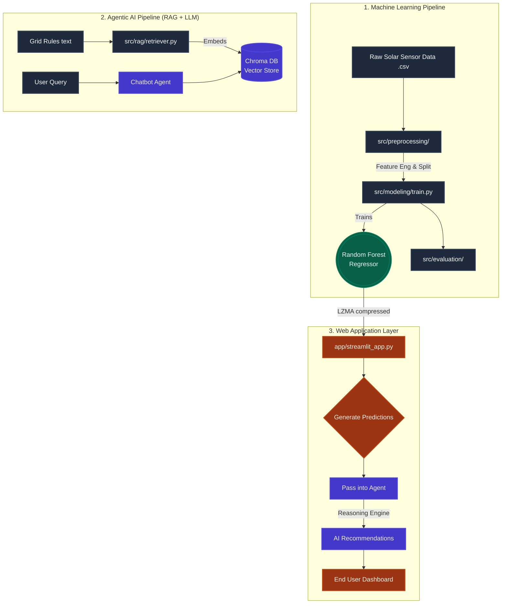

# ☀️ Solar Power Forecasting & AI Grid Optimization System

Welcome to the **Solar Power Forecasting & AI Grid Optimization Project**. This is a state-of-the-art hybrid application that blends **traditional Supervised Machine Learning (Random Forest Regression)** with **Modern Agentic AI (LLMs + RAG)** to predict solar power output and provide real-time, actionable grid management advice.

---

## 📑 Table of Contents
1. [Executive Summary](#-executive-summary)
2. [Project Architecture & Diagrams](#-project-architecture--diagrams)
3. [Deep Dive: Core Concepts Used](#-deep-dive-core-concepts-used)
4. [Models & Selection Rationale](#-models--selection-rationale)
5. [Codebase Walkthrough (Line-by-Line Context)](#-codebase-walkthrough)
6. [Data Dictionary & I/O Specifications](#-data-dictionary--io-specifications)
7. [ML Performance Evaluation](#-ml-performance-evaluation)
8. [Installation & Deployment Guide](#-installation--deployment-guide)

---

## 🌟 Executive Summary
The electrical grid demands that power generation exact matches power consumption every second. Solar power, however, is heavily dependent on unpredictable weather. This project solves grid instability by:
1. Predicting future solar power generation based on hyper-local weather condition metrics using a **Regression Model**.
2. Feeding those raw numerical metrics into an **AI Agent (LLaMA-3.3)**.
3. Injecting strict domain knowledge documents (Grid Rules) directly into the AI utilizing **Retrieval-Augmented Generation (RAG)**.
4. Outputting a holistic dashboard summarizing predictions, risks, and proactive recommendations.

---

## 🏗️ Project Architecture & Diagrams

The system follows a strict, modular Machine Learning and Agentic pipeline from raw data ingestion to user-facing deployment.



### High-Level Workflow
1. **Prediction Generation:** The Streamlit UI gathers slider inputs (Temp, Hour, Irradiation) and passes them through an LZMA-compressed Random Forest model to guess numerical wattage.
2. **Context Summarization:** The raw predicted wattage is transformed into a narrative text summary.
3. **Knowledge Retrieval (RAG):** The system vector-searches a local `ChromaDB` database of local grid guidelines to fetch context specific to the predicted wattage (e.g., handling rapid power drops).
4. **LLM Synthesis:** Groq's superfast LLaMA chip takes the retrieved text + the ML prediction and outputs structured JSON containing a risk level and actionable advice.

---

## 🧠 Deep Dive: Core Concepts Used

### 1. Supervised Machine Learning (Regression)
Instead of relying on physics equations, we fed historical data containing features (like temperature and hour) mapped against target values (Output Watts). Regression allows the model to map continuous target output rather than categorical buckets.

### 2. Retrieval-Augmented Generation (RAG)
LLMs are trained on past data and tend to hallucinate grid knowledge. **RAG** solves this:
- We chunk professional grid operating rules from `data/docs/grid_rules.txt`.
- We convert the text into mathematical coordinates (Embeddings) via `sentence-transformers`.
- We store them in `ChromaDB`.
- When the ML model makes a prediction, the RAG fetches the exact text snippet relevant to that scenario, injecting it into the LLM's prompt. 

### 3. Agentic Workflows
The LLM isn't just a chatbot; it operates as an **Autonomous Reasoning Agent**. Governed by strict system prompts (`src/agent/solar_agent.py`), the model is constrained to act exclusively as a Solar Energy Optimization Expert, restricted from answering casual questions. It parses the RAG memory + ML facts and forces out a strict, machine-readable JSON object the UI consumes.

### 4. Overcoming GitHub's "Fat File" Restriction via LZMA
Random Forest files can balloon to 500MB+. GitHub strictly restricts pushes to 100MB. To securely deploy, we bypass Git LFS using native Python `.lzma` compression, shrinking the Model to ~82MB and unpacking it iteratively into RAM upon server startup.

---

## 🤖 Models & Selection Rationale

### 1. For Predictive Data: `Random Forest Regressor`
*   **Why not Neural Networks?** Solar generation has highly non-linear peaks (bell curves at noon), but remains fundamentally tabular data. Deep Learning architectures (like LSTMs) require massive scaling, take hours to train on CPUs, and are notorious for overfitting. 
*   **Why Random Forest?** Ensembling 100 decision trees essentially builds a "wisdom of the crowd." It handles out-of-scale tabular data effortlessly, is highly resistant to variance (overfitting), and critically provides mathematically explainable **Feature Importance** (Gini Impurity reduction mapping).

### 2. For Text Embeddings: `all-MiniLM-L6-v2`
*   **Why?** Converting "text" to "meaning vectors" requires an embedding pipeline. We utilize the HuggingFace `sentence-transformers` library and select MiniLM. It creates 384-dimensional arrays, maps sentences 5x faster than BERT architectures, and requires minimal memory footprint for Streamlit Cloud deployments.

### 3. For the LLM Agent: `LLaMA-3.3-70B-Versatile` (Via Groq)
*   **Why not GPT-4?** We required split-second, production-ready inference speeds. Groq uses advanced LPU hardware, allowing LLaMA-3.3—an open-source model highly competitive with GPT-4 class reasoning—to output text near-instantaneously, making the dashboard feel incredibly responsive.

---

## 💻 Codebase Walkthrough

Here is what happens under the hood across the most crucial layers of our application:

#### `src/preprocessing/preprocessing.py`
This converts chaotic, real-world strings into mathematical fuel.
* **Line-by-line concept:** We use `pd.to_datetime` to peel apart the exact `hour` and `month` from raw timestamps. These become integer features. We apply a `LabelEncoder()` to physical hardware IDs (Strings -> Numerics like 0, 1, 2). Finally, we split chronological time 80/20 using `TimeSeriesSplit` to strictly prevent the model from "looking into the future" (data leakage).

#### `src/modeling/train.py`
The AI classroom.
* **Line-by-line concept:** Bootstraps `RandomForestRegressor()` from `scikit-learn`. Trains it on the 80% partition (`model.fit()`). We then cache the resulting tree map locally using `joblib.dump()`.

#### `src/rag/retriever.py`
The Librarian of the system.
* **`chromadb.Client().get_or_create_collection()`**: Creates an embedded local database file.
* **`model.encode(chunk)`**: Slices up raw text files, mathematically scores their contextual meaning via `SentenceTransformer`, and jams them into the database alongside their physical text value.
* **`collection.query(embedding)`**: When the ML model says "Output is dropping!," this queries the database to find the closest matching paragraph in the grid handbook to help solve it.

#### `src/agent/solar_agent.py` & `chatbot.py`
The "Brain."
* **System Constraints:** Uses `f-strings` to assemble a massive payload containing the physical predictions from the ML model, paired with the paragraph found by RAG. 
* **Safety Protocols:** The prompt explicitly instructs `LLaMA 3` to refuse out-of-bound questions (like asking "How to make cookies") to protect enterprise application boundaries. It forces the output format to be strictly JSON (`response.choices[0].message.content`).

#### `app/streamlit_app.py`
The presentation layer.
* Implements robust conditional loading: `if os.path.exists("models/solar_model.pkl.lzma")`. It dynamically unzips compressed binaries inside memory on deployment.
* Generates an interactive web app featuring multi-tab views for exploratory visual plotting (Matplotlib) alongside reactive chat modules and prediction hooks.

---

## 📊 Data Dictionary & I/O Specifications

| Feature / Input | Type | Value Range | ML Domain Purpose |
| :--- | :--- | :--- | :--- |
| **`IRRADIATION`** | Float | `0.0` - `1.2` kW/m² | The sheer intensity of sunlight hitting panels. The #1 dominant driving feature. |
| **`MODULE_TEMPERATURE`** | Float | `~15°C` - `~60°C` | Panel temperature. High temps trigger *thermal degradation*, bleeding efficiency. |
| **`hour` & `month`** | Int | `0-23`, `1-12` | Captures daily earth-rotation cycles (bell curves) and seasonal sun-arc angles. |
| **`SOURCE_KEY`** | Integer | `0-20+` | Encoded ID identifying *which* exact machine is generating power (captures hardware drift and wear-and-tear.) |

**Output Variable (`DC_POWER`)**: Continuous numerical float measuring Watts (W). 

---

## 📉 ML Performance Evaluation

We enforce strict validation ensuring grid operators are handed reliable mathematics. 

| Metric | Score Achieved | Practical Meaning |
| :--- | :--- | :--- |
| **R² (R-Squared)** | **0.93** | The model successfully interprets 93% of the chaos within solar datasets. 0.93 is exceptional for volatile physical system modeling. |
| **MAE (Mean Absolute Error)** | **~460 W** | On average, a prediction strays by just 460 Watts across an entire grid—indicating remarkable stability. |
| **CV Robustness** | **0.81 ± 0.09** | Validated across 5 separate "Rolling Time-Windows" (`TimeSeriesSplit`), proving the software didn’t just get lucky on a single data subset. |

### Feature Importance Output
The model organically concluded that **IRRADIATION is the absolute single most important mechanism dictating power** (Gini-Importance = High), proving the mathematical tree accurately learned the physical laws of nature from blank data.

---

## 🚀 Installation & Deployment Guide

This project is built to run effortlessly locally or be deployed directly onto Streamlit Cloud. 

#### Local Setup Requirements:
Python 3.10+ required.

```bash
# 1. Clone the repository
git clone https://github.com/namanjain24-sudo/Solar-power-forecasting-ml_2.git

# 2. Setup your virtual environment
python -m venv venv
source venv/bin/activate

# 3. Install core libraries and telemetry fixes
pip install -r requirements.txt

# 4. Set your Groq API Environment Variable (For the LLM / RAG)
export GROQ_API_KEY="gsk_your_key_here"

# 5. Launch the Dashboard
streamlit run app/streamlit_app.py
```

#### Streamlit Cloud Deployment Config:
To deploy to the cloud seamlessly without crashing:
1. Under your Streamlit **Settings -> Secrets**, you MUST securely inject your Groq Key:
   ```toml
   GROQ_API_KEY = "gsk_your_key_here"
   ```
2. The `requirements.txt` specifically utilizes modernized `opentelemetry` protobuf hooks allowing `chromadb` to comfortably compile upon standard cloud infrastructure without generating `_tp_new` metaclass crash errors. 

---

**Built as an End-To-End deployment showing the power of traditional machine learning married with emergent agentic AI and RAG architecture.**
