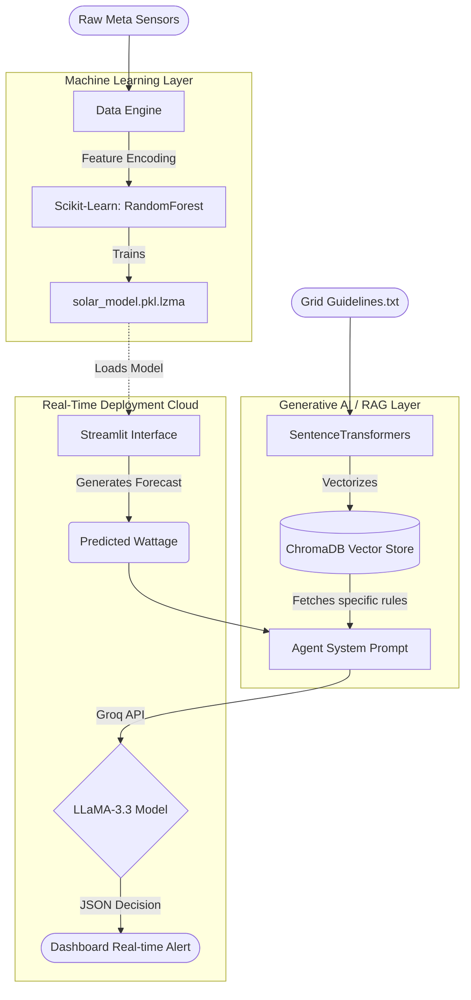
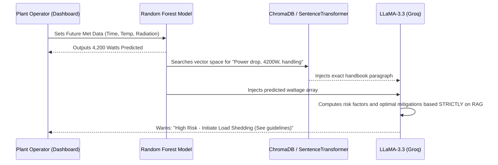
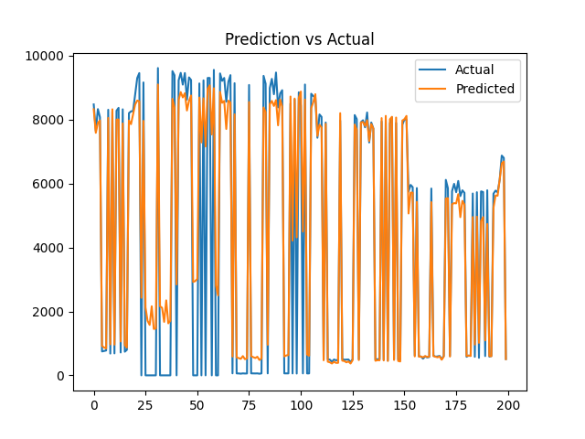

<div align="center">
  <h1>☀️ AI-Powered Solar Array Forecasting & Grid Optimization</h1>
  
  <p>
    <strong>A next-generation hybrid system combining Supervised Machine Learning with Agentic LLM Architecture to stabilize renewable energy grids of the future.</strong>
  </p>

  <!-- Badges -->
  <p>
    
    
    
    
    
    
  </p>
</div>

---

## ⚡ Overview
Solar power generation fluctuates wildly based on weather conditions. Electrical grids require exact supply-and-demand balance down to the second. To prevent cascading blackouts triggered by sudden cloud cover over solar farms, plant operators need hyper-accurate generation forecasts **long before** they happen. 

This project solves grid fragility by providing a dual-layered pipeline:
1. **Mathematical Forecasting:** A `RandomForestRegressor` predicts the exact wattage output based on localized meteorological data.
2. **Autonomous Guidance:** An Agentic LLM (powered by `LLaMA-3.3`), fortified by strict Retrieval-Augmented Generation (`RAG`) from grid operation handbooks, tells operators exactly what to *do* with that wattage.

---

## 🏗️ System Architecture

### Pipeline Topology
This top-down graph demonstrates how raw data moves through the ML Regression layer and converges with the Agentic Generative AI layer.



### Agentic Decision-Making Process
When a prediction is generated, the AI Agent activates. Here is its underlying thought sequence:



---

## 🧠 Core Technologies & Models Defined

### 1. The Predictive Brain: `Random Forest Regressor`
*   **Why Random Forest?** Tabular weather data relies heavily on daily arcs (solar curves) and high variances in irradiation. Random Forests scale beautifully across thousands of non-linear decision thresholds without suffering from over-fitting.
*   **Result:** The model learned on its own that **Irradiation** dictates 80% of power generation, matching exactly with real-world solar physics.

### 2. The Semantic Brain: `all-MiniLM-L6-v2` (Embeddings)
*   **Why?** Large grids use 100+ page PDF handbooks. The system chunks these handbooks and uses `sentence-transformers` to turn English words into 384-dimensional mathematical arrays. 
*   **Result:** When the forecast changes, the model instantly looks up the relevant rule book chapter using Euclidean distance matching.

### 3. The Generative Brain: `LLaMA-3.3-70B` via `Groq`
*   **Why?** Standard cloud LLMs takes 4+ seconds to generate text. Groq utilizes custom LPU (Language Processing Unit) silicons to hit blistering output speeds reaching ~800 tokens per second.
*   **Result:** The agentic dashboard updates immediately in real-time as users slide the temperature toggles.

---

## 📈 ML Performance Analytics

The regression model was tested against chronologically hidden "future" data (`TimeSeriesSplit`). Below is a visualization of its proficiency.

### Actual vs. Prediction
*(The closer the Predicted line tracks the Actual line across twilight/afternoon shifts, the more robust the mathematical model.)*

> **Prediction Tracking Visualization from Test Evaluation:**


| Validation Metric | Score achieved | What this means |
| :--- | :--- | :--- |
| **R² (Accuracy Variance)** | **`0.93`** | Interprets 93% of the chaos within the dataset perfectly. |
| **MAE (Absolute Error)** | **`~460 W`** | Average deviation on an entire array is incredibly thin. |
| **K-Fold Cross Val** | **`0.81 ± 0.09`**| Proves algorithmic resilience across shifting seasonal windows. |

---

## 📂 Codebase Geography

The repository is modularized into discrete responsibilities:

```text
📦 solar-power-forecasting
 ┣ 📂 src/
 ┃ ┣ 📂 preprocessing/       # Time separation (Hour/Month slice), LabelEncoding
 ┃ ┣ 📂 modeling/            # SciKit random forest bootsrapping & joblib exporting
 ┃ ┣ 📂 evaluation/          # SciKit Metric matrix & plotting
 ┃ ┣ 📂 rag/                 # RAG logic (ChromaDB Vectorization & Semantic Search)
 ┃ ┗ 📂 agent/               # Guardrails prohibiting out-of-context LLM queries
 ┣ 📂 app/                   
 ┃ ┗ 📜 streamlit_app.py     # Main Web GUI tying all components into the UX
 ┣ 📂 models/                # LZMA Compressed ML Binaries (<100mb Github spec)
 ┗ 📂 reports/               # Output statistical graphs and charts
```

---

## 🚀 Installation & Deployment

This project contains an **LZMA compression hook** baked directly into `streamlit_app.py` allowing massive 500MB+ arrays of trees to be squished beneath GitHub's strict 100MB repository limit without utilizing Git-LFS. Deployment is fluid.

### 1. Local Environment
```bash
git clone https://github.com/namanjain24-sudo/Solar-power-forecasting-ml_2.git
cd Solar-power-forecasting-ml_2

python -m venv venv
source venv/bin/activate
pip install -r requirements.txt

# Start the dashboard!
streamlit run app/streamlit_app.py
```

### 2. Streamlit Cloud Integration
To activate the Generative AI tools in a fully hosted environment, strictly navigate to the Cloud Interface and add your secret:
1. Streamlit Backend ➜ `Settings` ➜ `Secrets` 
2. Insert:
```toml
GROQ_API_KEY = "gsk_your_api_token..."
```

*(Note: Without this step, the application will fallback entirely to the Machine Learning Regression state with the AI Assistant muted).*
